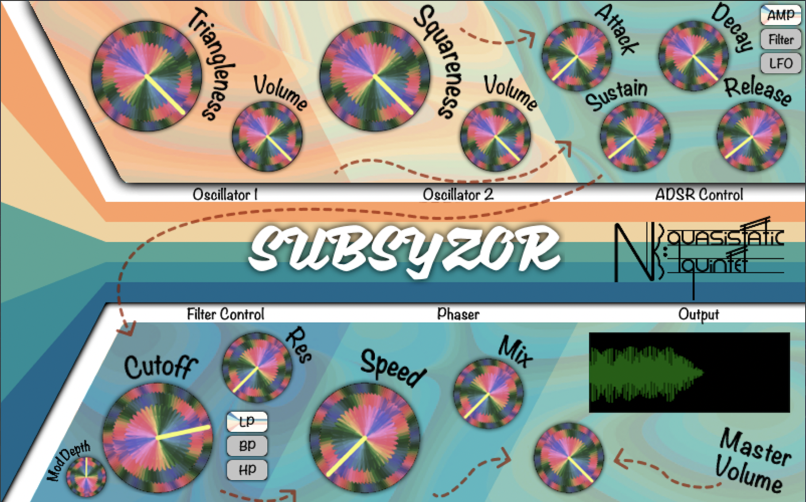

Welcome to the "Subsyzor" by Nonlinear Quasistatic Quintet.

The aim of this project is to create a polyphonic subtractive synthetizer.  

## How to install
The code is provided as is with the ".jucer" file of the project included. To build the project open the Subsyzor.jucer file and then open the code on Visual Studio (if on a Windows computer) or on XCode (on a MacOs computer). From there build the project and open it with your audio software of preference 

## How to use
The plugin follows an ordinary subctractive synthesis approach in its general design so it should be quite familiar to a user who already has experience working with such synthetizers.

- ### Oscillators  
    There are two oscillators running in parallel. Their design is inspired by the oscillators that can be found in a Buchla modular system where the wave can be morphed between different shapes.  
    The first oscillator gives the option of morphing from a sine wave (0 value of triangleness) to a triangle wave and then to a more intense triangular one.  
    The second oscillator is less traditional in its wave design as the two waves that it can morph between are not standard. For ease of understanding we can consider it a parameter which allows to morph from a soft sawtooth to a soft square waveshape.  
    Each oscillator has an indipendent volume knob to set the respective volume.

- ### Modulations  
    There are three main modules to modulate parameters inside the plugin and they are all accessible from the three buttons on the top right of the GUI: Amplitude ADSR, Filter ADSR, LFO.
- ### ADSR  
    Subsyzor features two ADSRs: one to control the amplitude of the wave and one to modulate the filter cutoff frequency. Each of the ADSRs has its own attack, decay, sustain and release parameters to be set as desired. 

- ### LFO  
    When selected from the modulation parameters two knobs appear: Rate and Depth. The first is used to change the frequency of the LFO while the second impacts how much it will affect the chosen parameter. A toggle button will allow the user to change the desired modulated parameter from the pitch of the note to morph which dynamically changes both the quareness and the triangleness parameters. 

- ### Filter  
    The filter features three different modes: high-pass, band-pass and low-pass to allow the user to further customize the waveshape. Cutoff frequency and resonance can also be set from their indipendent knobs. The "Mod Depth" knob allows the user to fine-tune how much of the ADSR will affect the cutoff frequency. A higher value will yeld more audible results while lower values will result in a more subtle modulation.

- ### Phaser  
    A phaser can add another level of depth to the sound by adding movement to all the voices. The Speed and Mix parameters allow you to control the speed of the movement and how much phaser you want in your sound respectively.

- ### Oscilloscope
    A handy oscilloscope gives visual feedback on what is being played.  
 

## Notes
The plugin has been tested on both MacOs (version 12.3.1) and Windows 11 on the following hosts:
- Audio Plugin Host
- Reaper
- Ableton Live 11